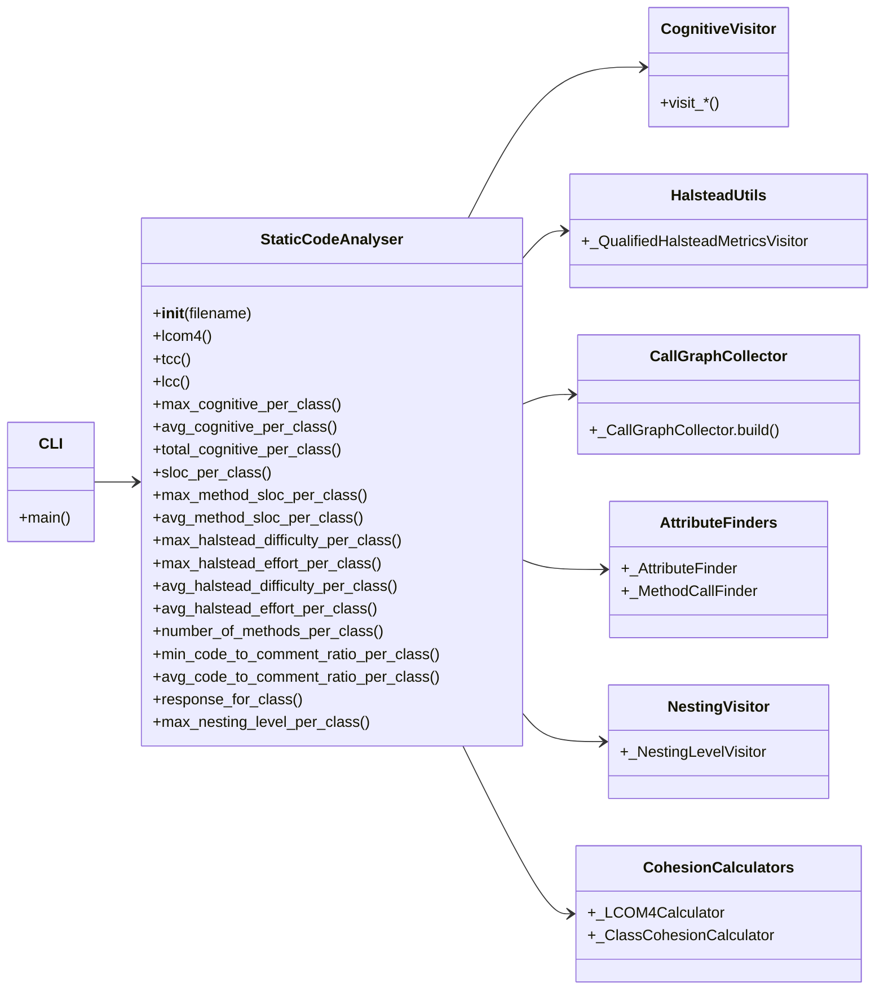

# StatsCodeAnalyser

Статический анализатор кода на Python, который вычисляет различные метрики качества программного обеспечения на уровне классов, с акцентом на связность, сложность, размер и другие характеристики. Инструмент парсит исходный код Python с помощью AST и предоставляет метрики через CLI, который выводит XML-отчёт.

## Инструкция по установке и сборке пакета

Для установки и сборки пакета:

1. Клонируйте репозиторий или скачайте исходный код.
2. Перейдите в корневую директорию проекта.
3. Установите необходимые зависимости:
   ```
   pip install -r requirements.txt
   ```
   (Это установит pytest и coverage для тестирования, но основной пакет не имеет зависимостей за пределами стандартной библиотеки.)
4. Соберите и установите пакет локально:
   ```
   python setup.py install
   ```
   Альтернативно используйте:
   ```
   pip install .
   ```

Это установит CLI-инструмент `stats_code_analyser`. Для использования:
```
stats_code_analyser -f путь/к/вашему_файлу.py -o report.xml
```
Это проанализирует указанный Python-файл и сгенерирует XML-отчёт с метриками для каждого класса.

## Информация о запуске тестов и что делает coverage

Для запуска тестов и генерации отчёта о покрытии выполните предоставленный скрипт:
```
./run_tests.sh
```

Этот скрипт:
- Устанавливает зависимости из `requirements.txt` (pytest и coverage).
- Запускает все unit-тесты с помощью `pytest` на файлах в директории `tests/`, охватывая когнитивную сложность, метрики связности, метрики Халстеда, вложенность, SLOC, RFC и интеграционные тесты.
- Использует `coverage` для отслеживания выполнения кода во время тестов.
- Выводит отчёт о покрытии, показывающий процент покрытия кода тестами для каждого файла в `src/`.

Coverage — это инструмент, который измеряет, какая часть исходного кода выполняется тестами. Он помогает выявить непротестированные части кода, обеспечивая надёжность и выявление потенциальных ошибок. Отчёт включает детальную информацию по строкам с флагом `-m` для указания пропущенных строк.

## Описание дизайна проекта

Проект спроектирован как модульный Python-пакет для статического анализа, с акцентом на расширяемость и разделение обязанностей:

- **Основная структура**: Пакет расположен в `src/stats_code_analyser/`. Он использует модуль AST Python для парсинга кода без выполнения, обеспечивая безопасность и эффективность.
  
- **Фасадный паттерн**: `static_analyser.py` выступает центральным фасадом. Он инициализируется файлом, парсит его в AST-дерево и предоставляет методы для вычисления каждой метрики лениво (кэшируя результаты, чтобы избежать повторных вычислений).

- **Паттерн Visitor**: Большинство метрик вычисляются с помощью посетителей AST (наследников `ast.NodeVisitor`):
  - `attribute_finders.py`: Находит обращения к атрибутам self и вызовы методов для метрик связности.
  - `call_graph_collector.py`: Строит граф вызовов для RFC.
  - `cognitive_visitor.py`: Вычисляет когнитивную сложность с учётом вложенности и рекурсии.
  - `cohesion_calculators.py`: Вычисляет LCOM4, TCC и LCC с использованием графов методов и атрибутов.
  - `halstead_utils.py`: Токенизирует код и вычисляет метрики Халстеда по контекстам.
  - `nesting_visitor.py`: Измеряет глубину вложенности управляющих структур.

- **CLI-интерфейс**: `cli.py` предоставляет точку входа через командную строку с использованием `argparse`. Он создаёт экземпляр `StaticCodeAnalyser`, вычисляет все метрики и записывает XML-отчёт с помощью `xml.etree.ElementTree`.

- **Тестирование**: Директория `tests/` содержит unit-тесты для каждой метрики и посетителя, плюс интеграционные тесты. Тесты используют pytest и охватывают edge-кейсы, такие как пустые классы или синтаксические ошибки.

- **Утилиты**: `setup.py` для упаковки, `requirements.txt` для dev-зависимостей и `run_tests.sh` для удобного запуска тестов с покрытием.

Дизайн учитывает ограничения статического анализа: без выполнения кода, поэтому обрабатываются синтаксические особенности, но игнорируются runtime-поведения, такие как getattr или алиасы. Метрики ориентированы на классы, агрегируя данные на уровне методов, где это применимо.



## Метрики

Инструмент вычисляет следующие метрики, все агрегированные на уровне классов (например, max/avg по методам). Ниже приведён список с подробными алгоритмами подсчёта (основанными на реализации) и ссылками на источники.

### Список метрик
- LCOM4 (Lack of Cohesion in Methods — Отсутствие связности в методах)
- TCC (Tight Class Cohesion — Жёсткая связность класса)
- LCC (Loose Class Cohesion — Свободная связность класса)
- Максимальная когнитивная сложность на класс
- Средняя когнитивная сложность на класс
- Суммарная когнитивная сложность на класс
- SLOC на класс
- Максимальный SLOC метода на класс
- Средний SLOC метода на класс
- Максимальная сложность Халстеда (difficulty) на класс
- Максимальные усилия Халстеда (effort) на класс
- Средняя сложность Халстеда (difficulty) на класс
- Средние усилия Халстеда (effort) на класс
- Количество методов на класс
- Минимальное отношение код/комментарии на класс
- Среднее отношение код/комментарии на класс
- RFC (Response for a Class — Ответ для класса)
- Максимальный уровень вложенности на класс

### Подробные описания алгоритмов

#### LCOM4 (Lack of Cohesion in Methods)
**Алгоритм**: 
1. Собирается неориентированный граф, где вершины — методы и атрибуты класса.
2. Ребра: 
   - Между методом и атрибутом, если метод обращается к атрибуту через `self.<attr>` (используется посетитель AST для поиска чистых цепочек `self.x` или `self.a.b`, игнорируя динамику как `getattr`).
   - Между методами, если один вызывает другой через `self.<method>()` (аналогично, через посетитель для `ast.Call` на `self`).
3. Вычисляются связные компоненты графа (используя DFS или BFS для поиска компонент).
4. LCOM4 = количество компонент, содержащих хотя бы один метод (игнорируя изолированные атрибуты).
5. Если класс без методов, LCOM4 = 0.

**Источник**:
Hitz M., Montazeri B. Measuring Coupling and Cohesion in Object-Oriented Systems.

#### TCC (Tight Class Cohesion)
**Алгоритм**: 
1. Строится граф методов: вершины — методы класса.
2. Ребра между методами, если они делят хотя бы один общий атрибут (из обращений `self.<attr>` в каждом методе, собранных посетителем).
3. NDC = количество пар методов, соединённых ребром (прямые связи).
4. num_pairs = n*(n-1)/2, где n — количество методов.
5. TCC = NDC / num_pairs, если n >= 2; иначе TCC = 1 (или 0 для пустых классов).
6. Игнорируются динамические обращения.

**Источник**:
Bieman J. M., Kang B.-K. Cohesion and Reuse in an Object-Oriented System.

#### LCC (Loose Class Cohesion)
**Алгоритм**: 
1. Аналогично TCC, но учитываются косвенные связи: строится транзитивное замыкание графа (методы связаны, если есть цепочка через общие атрибуты).
2. Вычисляются связные компоненты методов.
3. Для каждой компоненты размера k: добавляется k*(k-1)/2 пар.
4. LCC = сумма пар по компонентам / num_pairs (где num_pairs как в TCC).
5. Если n < 2, LCC = 1.

**Источник**:
Bieman J. M., Kang B.-K. Cohesion and Reuse in an Object-Oriented System.

#### Когнитивная сложность (Максимальная/Средняя/Суммарная на класс)
**Алгоритм**: 
1. Посетитель AST обходит дерево, накапливая сложность по контекстам (методы, классы, global).
2. Базовые правила:
   - За каждую управляющую конструкцию +1 + текущий уровень вложенности (nesting): `if` (+1, обход условия с булевыми ops), `for` (+1), `while` (+1, + за булевы в тесте), `try` (+1 за try, +1 за каждый except), `with` (+1 за каждый item в with), `match` (+1 за match, без +1 за case, но + за guard если есть).
   - Булевы: для `a and b or c` + (N-1) где N=операнды (and/or), `not` без +1, но рекурсивно.
   - Тернарный `x if cond else y`: +1, + за булевы в cond, ветви с +nesting.
   - Comprehensions/генераторы: +1 за конструкцию, как эквивалент for-if: за каждый generator +1 (как for), за каждый if в generator +1 (как if), +nesting для тела/фильтров.
   - Рекурсия: +1 за вызов функции с именем текущей (проверяется по стеку имён).
3. Nesting: увеличивается при входе в тело конструкции, уменьшается при выходе.
4. Агрегация: по методам класса (ключи "class:Cls.method"), затем max/avg/sum на класс.

**Источник**:
SonarSource. Cognitive Complexity: A new way of measuring understandability.

#### Метрики Халстеда (Difficulty и Effort: Максимальная/Средняя на класс)
**Алгоритм**: 
1. Токенизация кода по диапазонам (lineno..end_lineno) методов/лямбд/классов.
2. Классификация токенов:
   - Операторы: OP (как +,*), ключевые слова (if, except, кроме True/False/None как операнды).
   - Операнды: NAME (не-ключевые), NUMBER, STRING, True/False/None.
   - Игнор: NL, NEWLINE, INDENT, DEDENT, COMMENT, ENDMARKER.
3. По методу: n1=уникальные операторы, n2=уникальные операнды, N1=все операторы, N2=все операнды.
4. Difficulty = (n1 / 2) * (N2 / n2) если n2>0, иначе 0.
5. Volume = (N1+N2) * log2(n1+n2) если n1+n2>0, иначе 0.
6. Effort = Difficulty * Volume.
7. Агрегация: max/avg по методам класса; нулевые случаи =0.

**Источник**:
Halstead M. H. Elements of Software Science.

#### SLOC (Source Lines of Code) на класс / Максимальный/Средний SLOC метода на класс
**Алгоритм**: 
1. Для класса/метода: диапазон lineno..end_lineno.
2. Считаем строки: не-пустые, не-только-комментарии (#...); inline-комментарии считаются кодом.
3. Вычитаем строки docstring (ast.get_docstring).
4. Агрегация: сумма по классу; max/avg по методам.

**Источник**:
Park R. E. Software Size Measurement: A Framework for Counting Source Statements.

#### Количество методов на класс
**Алгоритм**: Подсчёт узлов FunctionDef/AsyncFunctionDef в теле класса.

**Источник**:
Chidamber S. R., Kemerer C. F. A Metrics Suite for Object Oriented Design.

#### Отношение код/комментарии (Минимальное/Среднее на класс)
**Алгоритм**: 
1. По методу: code_lines = SLOC (с inline-комментариями); comment_lines = чистые комментарии + строки docstring.
2. Ratio = code_lines / max(1, comment_lines).
3. Агрегация: min/avg по методам класса.

**Источник**:
Steidl D., Hummel B., Juergens E. Quality Analysis of Source Code Comments.

#### RFC (Response for a Class)
**Алгоритм**: 
1. Строится ориентированный граф вызовов: caller -> set(callees), где callee — квалифицированные имена (function:name, class:Cls.method).
2. Разрешение: self.method() -> class:Current.method; Class.method() -> class:Class.method (если Class в модуле); name() -> все по простому имени.
3. Для каждого метода класса: DFS от метода, собирая достижимые узлы (включая себя).
4. RFC = max(размер множества) по методам; 0 для классов без методов.

**Источник**:
Chidamber S. R., Kemerer C. F. A Metrics Suite for Object Oriented Design.

#### Максимальный уровень вложенности на класс
**Алгоритм**: 
1. По методу: посетитель отслеживает nesting для структур: +1 за if (тело с +nesting, orelse без), for/async for (+1), while (+1), with/async with (+1 за item), try (+1 за try, +1 за except), match (+1 за match, +1 за case/body), comprehensions (+1 за конструкцию, +1 за generator как for, +1 за if в generator).
2. Max = пиковая глубина; вложенные функции/классы учитываются как часть внешнего.
3. Агрегация: max по методам класса.

**Источник**:
Oviedo E. I. A complexity measure based on nesting level.
